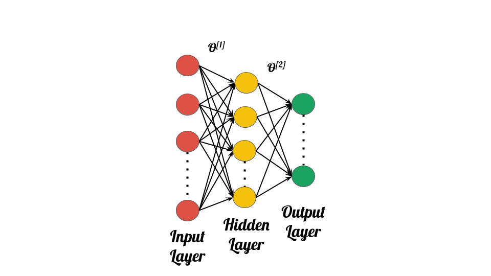
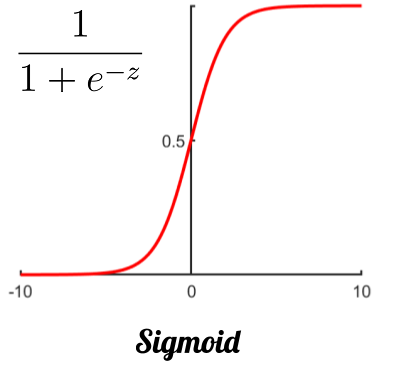

# Objective

- To train a neural network to recognise the handwritten digits from given images.

# Dataset

- There are 5000 images in ex3data1.mat, where each images is a 20 pixel by 20 pixel grayscale image of the digit.
- Below is the visualisation of a small part of the dataset.

  

# Neural Network

### Architecture

- Input layer: The 20 by 20 grid of pixels is “unrolled” into a 400-dimensional vector, so we have 400 nodes + 1 bias node, as inputs.
- Hidden layer: There are 25 nodes.
- Output layer: There are 10 nodes (corresponding to the 10 digit classes). 

  

### Dimensions

- X - 5000 x 400
- Ө1 - 25 x 401
- Ө2 - 10 x 26

### Cost function

- Regularised cost function is used.

  

### Activation Function

- Sigmoid activation function is used in all the layers.

  

# Visualising the hidden layer

- One way to understand what your neural network is learning is to visualize what the representations captured by the hidden units. The ith row of Θ1 is a 401-dimensional vector that represents the parameter for the ith hidden unit. If we discard the bias term, we get a 400 dimensional vector that represents the weights from each input pixel to the hidden unit. Thus, one way to visualize the “representation” captured by the hidden unit is to reshape this 400 dimensional vector into a 20 × 20 image and display it.

- By observing the image below, we find that the hidden units corresponds roughly to detectors that look for strokes and other patterns in the input.

  

# Reference
- Machine Learning by Stanford University on Coursera.
